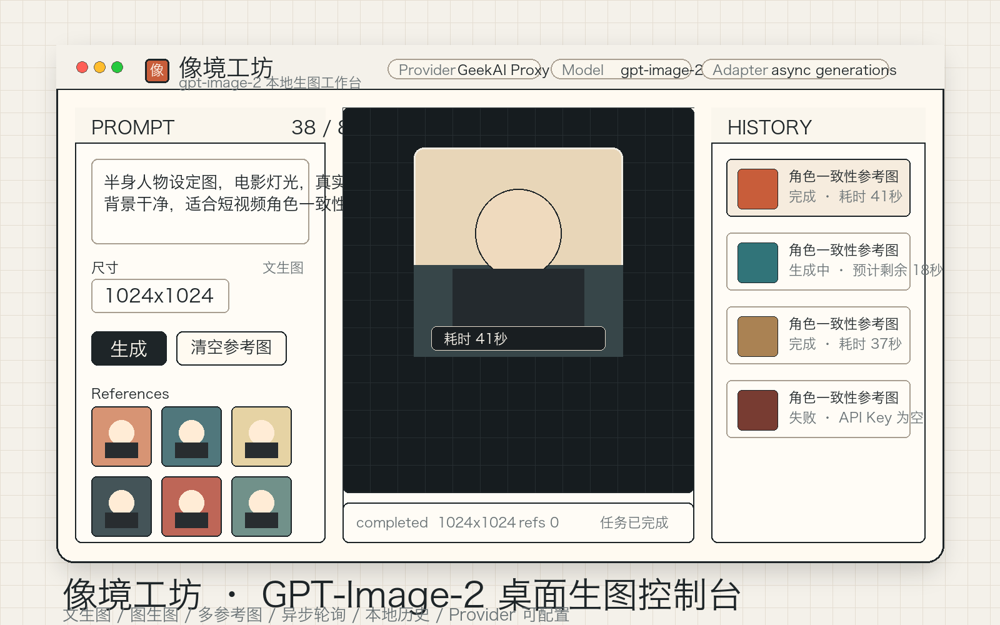

# 像境工坊

面向 `gpt-image-2` 的轻量桌面生图工作台。它把文生图、图生图、多参考图、异步轮询和本地历史收在一个安静的 Tauri 应用里，适合做角色一致性参考、短视频素材草图、设计探索图和日常图片生成。



## 亮点

- **主打 gpt-image-2**：默认模型为 `gpt-image-2`，默认 Base URL 为 `https://geekai.co/api/v1`。
- **测试支持极客智坊**：内置 GeekAI Proxy 配置入口，填入 API Key 后即可尝试。
- **文生图 / 图生图自动判断**：没有参考图就是文生图，有参考图自动切到图生图。
- **多参考图**：支持拖拽、点击选择、粘贴添加参考图。
- **异步任务体验**：后端提交任务，前端自动刷新状态；历史里记录等待时间和实际生成耗时。
- **本地历史**：点击历史记录可回填提示词、尺寸和参考图，方便复用。
- **Provider 可配置**：可修改 Provider 名称、Base URL、模型名、API Key 和 adapter。
- **本地优先**：API Key 只保存在本机应用数据目录，不提交到仓库。

## 适合谁

- 想用兼容 OpenAI 图片接口的 Provider 快速试 `gpt-image-2`。
- 需要把角色图、服装图、风格图作为参考图反复生成。
- 不想每次都写脚本轮询异步结果，希望有一个干净的桌面控制台。

## 快速开始

需要安装 Node.js、Rust 和 Tauri 所需平台依赖。

```bash
npm install
npm run tauri:dev
```

构建本机安装包：

```bash
npm run tauri:build
```

## Provider 设置

默认配置：

| 项 | 默认值 |
|---|---|
| Provider | GeekAI Proxy |
| Base URL | `https://geekai.co/api/v1` |
| Model | `gpt-image-2` |
| Adapter | `async_generations` |

打开右上角设置按钮，填入 API Key 即可使用。不同兼容服务的图片接口字段可能不同，如果返回结构不一致，可以切换 adapter。

## 打包与发布

仓库内置 GitHub Actions：

- 推送 `v*` 标签时自动构建并发布 GitHub Release。
- macOS：构建 Apple Silicon 和 Intel 的 DMG。
- Windows：构建 NSIS 安装包。
- 当前 macOS 使用 ad-hoc 签名，适合测试分发，但不等于 Apple notarization。公开下载后若要完全避免 Gatekeeper 的“无法验证 / 包损坏”类提示，需要 Developer ID Application 证书和 Apple 公证；Windows 若要减少 SmartScreen 提示，需要代码签名证书。

发布示例：

```bash
git tag v0.1.2
git push origin v0.1.2
```

## 隐私说明

仓库不包含任何真实 API Key。运行时填写的密钥只存放在用户本机应用数据目录中。

## 技术栈

- Tauri 2
- Rust
- Vite
- 原生 Web UI

## License

MIT
